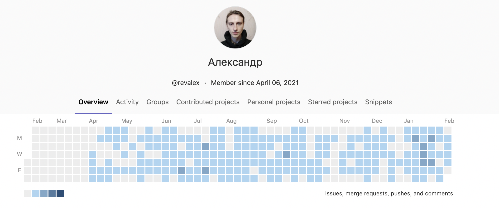
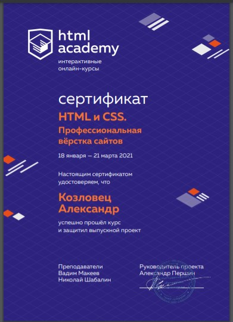

# 👋 Привет! Меня зовут Александр, я frontend/mobile (React Native) разработчик.

Я имею уже более 1.5 года опыта разработки фронтенд-приложений на React / Vue.js, а также кроссплатформенных мобильных приложений на React-Native.

## Что умею:

- Адаптивно верстать, используя сборщики, оптимизацию файлов, создаю кроссбраузерную семантически корректную разметку, и лаконичные стили без лишних костылей:)
- Умею создавать анимации, различные эффекты как с помощью популярных библиотек, так и на нативном css+js если подключение сторонних решений - оверхед.
- Умею работать с множеством решений экосистем React/React-Native/Vue для роутинга/стейт-менеджмента/локализации/создания форм в том числе со сложной логикой/валидацией.
- Cоздавать приятный пользовательский опыт как на вышеуказанных фреймворках так и на стандартных HTML/CSS/JS.
- Работать в команде используя Git, Github, Gitlab, Trello.
- Хорошо владею английским языком, на уровне свободного просмотра контента, чтения материалов в том числе технических, поддержания диалога, гуглю тоже на нем:D

## Изучаю:

- Typescript.
- Node.js/express, могу на базовом уровне писать серверные приложения, REST API.

## Стек:

- Разметка: Семантика и правильная БЭМ-структура.
- Стили: Адаптивность, pixel-perfect, кроссбраузерность, оптимизация ресурсов. Использую SCSS, PostCSS, Tailwind
- JS/Фреймворки: Хорошо знаю ES6 синтаксис, React, React-Native, Vue.
- Стейт менеджмент: Redux, Redux-Toolkit, Redux-thunk, Vuex.
- Роутинг: Vue-Router, React-Router, React-Navigation.
- Анимации: GSAP, AOS, CSS-анимации, прочие решения по необходимости
- Локализация: Vue-i18n, React-i18next.
- Бандлеры: Gulp/Webpack/Vite.
- Различные решения для создания слайдеров/тултипов и прочих интерактивных элементов. 

## Достижения:
Успешно окончил курс [HTML и CSS. Профессиональная вёрстка сайтов](https://htmlacademy.ru/intensive/htmlcss) 

## Контакты

email - kozlovetsalexandr@gmail.com

telegram - @AlexandrK8118
